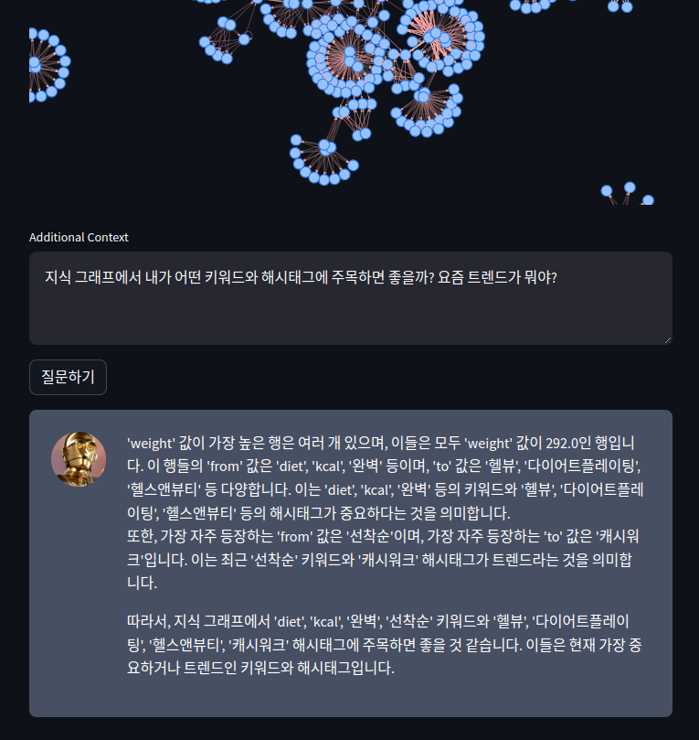

# 가톨릭대학교 마켓컬리 데이터 분석 경진대회
+ 팀원 : 김건우 김현이 류승열
## 설치하기
```bash
mkdir kurly
cd kurly
git clone https://github.com/wintenboy/kurly_contest.git
``` 
+ 패키지 의존성 관리 툴인 poetry가 설치되어 있다고 전제.
+ poetry install 명령어를 입력하여 패키지 설치
```bash
poetry install
```
## 전처리
+ 크롤링된 데이터에 존재하는 값들을 적절히 활용하여 파생변수를 생성.
+ 텍스트에 불필요한 불용어들을 모두 제거
+ 전처리 완료된 데이터를 활용하여 지식그래프 생성
### 데이터 기본 전처리
```bash
python preprocess.py --data_path [입력 데이터 경로] --types [홈페이지 리뷰 or 블로그 포스팅] --output_path [출력 데이터 경로]
```
### 지식그래프 생성
```bash
python make_network.py --data-path [전처리 완료 데이터] --types [홈페이지 리뷰 or 블로그 포스팅] --output_path [지식그래프 데이터 경로]
```

## 지식그래프 기반 Chat bot
### 실행하기
```bash
streamlit run app.py
```
+ 파일 업로드 후 지식그래프 생성
+ 
+ 질문을 통한 답변
+ 